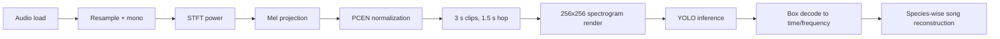

# `detect_birds.py` Internals

This page documents the inference pipeline in `src/inference/detect_birds.py` and `src/inference/utils/pcen_inference.py` from signal to final annotation-ready output.

## High-Level Flow

## 1) Audio Ingestion

- Supported extensions: `.wav`, `.flac`, `.ogg`, `.mp3`
- Loader order:
  - primary: `soundfile.read(...)`
  - fallback: `librosa.load(...)` if decoding fails
- Multi-channel recordings are collapsed to mono by channel averaging.
- Lossy formats (`.mp3`, `.ogg`) trigger warnings because the model is trained on lossless data.

## 2) STFT, Mel, and PCEN

The detector reuses training-compatible transforms:

- resampling to target sample rate (`sr = 32000`)
- STFT with configured FFT/window/hop settings
- mel spectrogram projection (`htk=True`)
- PCEN to stabilize dynamic range and suppress stationary background

Conceptually:

$$
X(t, f) = |STFT(x)|^2 \rightarrow M(t, m) \rightarrow PCEN(M)
$$

where `PCEN` behaves like an adaptive gain control plus compression, improving robustness in long-field recordings with varying noise floors.

## 3) Clip Tiling Strategy

- clip length: `3.0 s`
- hop: `1.5 s` (50% overlap)
- each clip is rendered to `256 x 256` pixels

Overlap reduces boundary misses. A call near the edge of one clip appears closer to center in an adjacent clip, increasing detection stability.

## 4) YOLO Output Decoding

Each YOLO box (`x1,y1,x2,y2`) is decoded as:

- **time**:
  - `time_start = clip_start + (x1 / 256) * clip_duration`
  - `time_end   = clip_start + (x2 / 256) * clip_duration`
- **species**:
  - class index -> eBird code via mapping loaded from `config.get_species_mapping(...)`
- **frequency**:
  - y coordinates are converted from pixels back to Hz using inverse mel transformation (`pixels_to_hz`)
  - top pixel is high frequency, bottom pixel is low frequency

## 5) Annotation Coordinate Semantics

BirdBox outputs rectangle annotations in:

- `time_start`, `time_end` in seconds from file start
- `freq_low_hz`, `freq_high_hz` in Hz
- species as eBird code (`species`) and numeric class id (`species_id`)

These fields are compatible with downstream evaluation CSV conventions and can be exported to:

- JSON with algorithm metadata
- simplified CSV
- Xeno-Canto Annota-JSON
- Raven selection table

## 6) Song Reconstruction

Raw detections across overlapping clips contain duplicates and fragments. `reconstruct_songs(...)` merges detections when:

- same `species_id`
- same source file (for multi-file runs)
- temporal gap `<= song_gap_threshold`

Merged output stores:

- `avg_confidence`
- `max_confidence`
- `detections_merged`
- min/max merged frequency span

This is intentionally distinct from plain NMS: reconstruction aims to recover biologically meaningful continuous song segments, not just deduplicate boxes.

## 7) Concurrency and Safety

- parallel clip inference via `--workers` uses separate YOLO model copies per worker
- file/process locks guard non-thread-safe inference paths in shared environments
- Streamlit app sessions instantiate detectors per user session

## 8) Deterministic Evaluation Recommendation

For reproducible threshold studies:

1. run inference once with low `--conf` and `--no-merge`
2. do threshold exploration in evaluation scripts
3. finalize by filtering + merging once at chosen confidence

This avoids running the network repeatedly and keeps threshold comparisons consistent.
