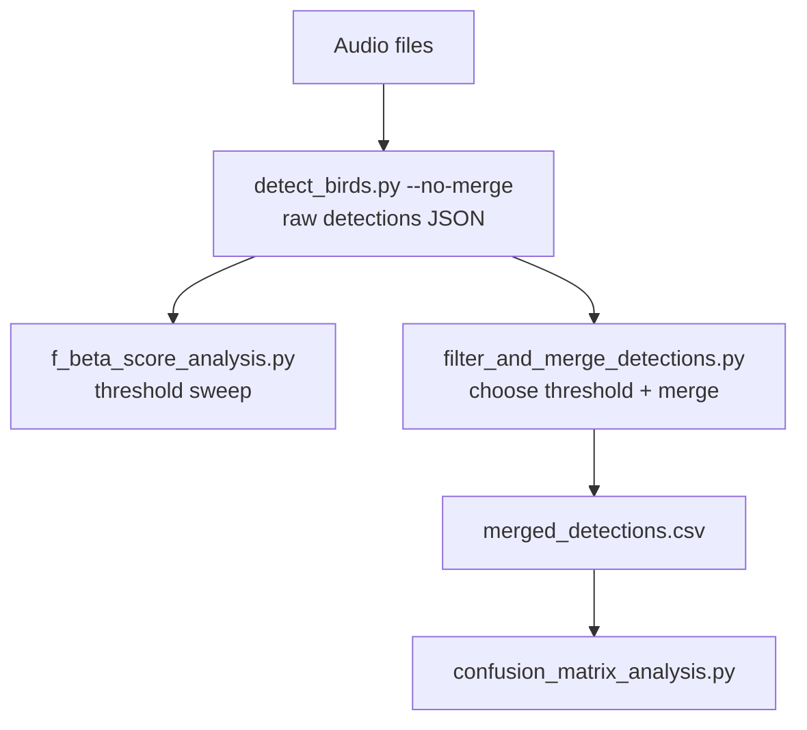
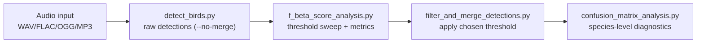

# Pipeline Overview

BirdBox evaluation is designed around a **raw-detections-first** workflow:

1. run inference once with permissive confidence and `--no-merge`
2. optimize operating threshold with F-beta analysis
3. apply the chosen threshold and reconstruct songs
4. evaluate class confusion on merged detections

This avoids re-running expensive inference while exploring thresholds.

## Stage Graph



## Stage Responsibilities

- `src/inference/detect_birds.py`
  - loads audio, computes PCEN clips, runs YOLO, converts boxes to time/frequency
  - with `--no-merge`, preserves raw detections for later threshold sweeps
- `src/evaluation/f_beta_score_analysis.py`
  - for each confidence threshold: filter raw detections, merge songs, match to labels
  - reports per-class and aggregate precision/recall/F-beta
- `src/evaluation/filter_and_merge_detections.py`
  - applies a single chosen threshold and exports standardized artifacts
- `src/evaluation/confusion_matrix_analysis.py`
  - computes class confusion diagnostics (1D or 2D IoU matching)

## Why Filter Then Merge

Song reconstruction changes object duration and confidence aggregation. If merging happens before threshold exploration, threshold behavior is biased by a specific pre-merge decision.

BirdBox therefore evaluates thresholds in the same order used in deployment:

1. confidence filter
2. temporal merge (`song_gap`)

## Typical Command Sequence

```bash
python src/inference/detect_birds.py --audio datasets/SET/soundscape_data --model models/SET.pt --species-mapping SET --output-path results/SET/raw_detections --output-format json-with-algorithm-metadata --conf 0.001 --no-merge
python src/evaluation/f_beta_score_analysis.py --detections results/SET/raw_detections.json --labels datasets/SET/annotations.csv --output-path results/SET/f_1.0_score_analysis --beta 1.0 --iou-threshold 0.25
python src/evaluation/filter_and_merge_detections.py --input results/SET/raw_detections.json --output-path results/SET/merged_detections --conf 0.2 --song-gap 0.1 --output-format all
python src/evaluation/confusion_matrix_analysis.py --detections results/SET/merged_detections.csv --labels datasets/SET/annotations.csv --output-path results/SET/confusion_matrix_analysis --iou-threshold 0.25
```

## End-to-End Workflow

