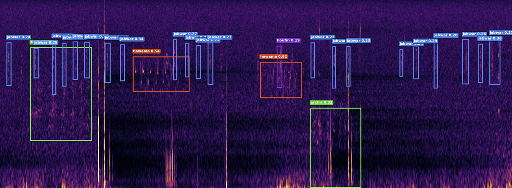

  <h1>BirdBox</h1>
  
  
  
  
<strong>Deep Learning Bird Call Detection & Evaluation System</strong>

  
  
  
  

BirdBox is a comprehensive system for detecting and evaluating bird calls in audio recordings using deep learning. It leverages YOLO (You Only Look Once) object detection on spectrogram images to identify and localize bird vocalizations in time and frequency.

⚠️ **Note**: This project is still under active development. Performance may vary.

## Scope

This code repository focuses on model inference and post-processing for bioacoustic event detection.
Additionally, one can evaluate the performance of the model inference with ground truth annotations.
Metrics like precision, recall, F$\beta$ and confusion matrices are already implemented and ready to go.

What's not covered here is the model training.
For this see [BirdBox-Train](https://github.com/birdnet-team/BirdBox-Train){ target="_blank" rel="noopener noreferrer" } (currently only available from within the BirdNET-Team).

## Example Detection

The following image shows a visualization of a detection in an audio file.
The generated PCEN spectrogram reaches from 50 to 15,000 Hertz across a span of roughly 15 seconds.
The inference software found 4 different species vocalizations and was able to localize them in time and frequency.

**Note**: The inference software itself just takes in audio files and outputs the detections in various [formats](data/outputs.md). 
The spectrogram is never seen unless explicitly visualized.

## Key Features

- **Interactive Demo** - Streamlit frontend for quick tests
- **Arbitrary-Length Audio Processing** - Handle audio from seconds to hours  
- **Song Reconstruction** - Automatically merge temporally adjacent detections into continuous bird songs
- **Batch Processing** - Process entire directories of audio files
- **Comprehensive Evaluation** - F-beta analysis, confusion matrices, optimal threshold finding  
- **Multiple Output Formats** - JSON with algorithm metadata, simplified CSV, Xeno-Canto Annota-JSON, Raven Selection Table  
- **Model Agnostic** - Works with `.pt`, `.onnx`, `.engine` model formats

## Quick Links

- [Installation](getting-started/installation.md) - set up the environment
- [Interactive Demo](getting-started/demo.md) - streamlit WebApp
- [How it works](how-it-works/index.md) - pipeline description
- [CLI Reference](cli/index.md) - command line interface
- [Data In/Out](data/index.md) - datasets and output-format descriptions
- [Models and Metrics](models-and-metrics/index.md) - list of models with corresponding metrics
- [GitHub Repository](https://github.com/birdnet-team/BirdBox)

## License

The source code is licensed under the [MIT License](https://github.com/birdnet-team/BirdBox/blob/main/LICENSE){ target="_blank" rel="noopener noreferrer" }
