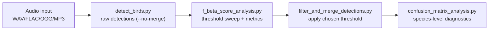

  <h1>BirdBox</h1>
  
  
  
  
<strong>Deep Learning Bird Call Detection & Evaluation System</strong>

  
  
  
  

BirdBox is a comprehensive system for detecting and evaluating bird calls in audio recordings using deep learning. It leverages YOLO (You Only Look Once) object detection on spectrogram images to identify and localize bird vocalizations in time and frequency.

# BirdBox

BirdBox is a technical detection and evaluation stack for avian bioacoustics:

- inference on arbitrary-length recordings with YOLO models on PCEN spectrogram clips
- species-aware post-processing that reconstructs continuous song segments
- evaluation tooling for threshold optimization and confusion-matrix diagnostics
- a Streamlit frontend that reuses the core inference implementation

## Scope

BirdBox focuses on **acoustic event detection and evaluation**, not model training.
Training-time preprocessing and dataset preparation live in companion repositories (for example BirdBox-Train), while this repository provides inference, post-processing, and evaluation for trained models.

## End-to-End Workflow

## Interfaces

- **CLI**: full pipeline control, batch processing, reproducible outputs.
- **Web app**: `streamlit run src/streamlit/app.py` for interactive inspection and export.

## Quick Links

- Installation and environment setup: `getting-started/installation.md`
- Minimal run commands: `getting-started/quickstart.md`
- Signal-processing and detection internals: `pipeline/detect-birds-internals.md`
- Complete CLI parameter reference: `cli/index.md`
- Input/output schemas and artifact definitions: `formats/index.md`

